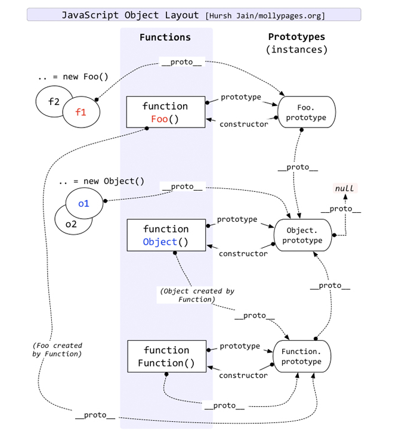
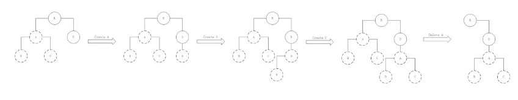
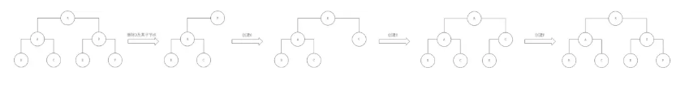

## THANKYOU
如果帮助到您，请star以给作者以鼓励，谢谢!!!


## JavaScript实现继承的方式
参考[JavaScript实现继承的方式](https://juejin.im/post/59e09676f265da430629cad2)
[JavaScript六种继承方式详解](http://caibaojian.com/6-javascript-prototype.html)


1.类式继承
```js
function Animal(age){
  this.age=18
  this.type=['pig','cat']
}
Animal.prototype.greet=function(sound){
    console.log(sound)
}
function Dog(){
    this.name='dog'
}
Dog.prototype=new Animal(18)
```

缺点
```
第一个是引用缺陷：
var dog1 = new Dog();
dog1.type.push('dog');
var dog2 = new Dog();
console.log(dog2.type);  // ["dog", "cat", "dog"]

第二个是我们无法为不同的实例初始化继承来的属性，我们可以修改一下上面的例子：
function Animal(age) {
  this.age = age;
  this.type=['pig','cat']
}
Dog.prototype = new Animal(18);
console.log(dog.age); // 18
console.log(do2.age); // 18
```

2.构造函数继承
```
// 声明父类

function Animal(age) {

  this.name = 'animal';

  this.type = ['pig','cat'];

  this.age = age;

}


// 添加共有方法

Animal.prototype.greet = function(sound) {

  console.log(sound);

}

// 声明子类

function Dog(age) {

  Animal.apply(this, arguments);

}

var dog = new Dog(18);
var dog2 = new Dog(20);

dog.type.push('dog');
console.log(dog.age);  // 18
console.log(dog.type);  // ["pig", "cat", "dog"]

console.log(dog2.type);  // ["pig", "cat"]
console.log(dog2.age);  // 20

 
 
```

缺点
```
但是，构造函数继承也是有缺陷的，那就是我们无法获取到父类的共有方法，也就是通过原型prototype绑定的方法：
dog.greet();  // Uncaught TypeError: dog.greet is not a function
```


3. 组合继承
```
// 声明父类   
function Animal(age) {    
  this.name = 'animal';    
  this.type = ['pig','cat'];    
  this.age = age;   
}     

// 添加共有方法  
Animal.prototype.greet = function(sound) {    
  console.log(sound);   
}     

// 声明子类   
function Dog(age) { 
  // 构造函数继承    
  Animal.apply(this, arguments);   
}   

// 类式继承
Dog.prototype = new Animal();   

var dog = new Dog(18);   
var dog2 = new Dog(20);     
dog.type.push('dog');   
console.log(dog.age); // 18
console.log(dog.type);  // ["pig", "cat", "dog"]
dog.greet('汪汪');  // "汪汪"
console.log(dog2.type); // ["pig", "cat"]
console.log(dog2.age);  // 20
```

缺点
```
这种组合继承也是有点小缺陷的，那就是它调用了两次父类的构造函数。
```


4.寄生组合式继承
```
function Animal(age) {
  this.age = age;
  this.name = 'animal';
  this.type = ['pig', 'cat'];
}

Animal.prototype.greet = function(sound) {
  console.log(sound);
}

function Dog(age) {
  Animal.apply(this, arguments);
  this.name = 'dog';
}


/* 注意下面两行 */
Dog.prototype = Object.create(Animal.prototype);
Dog.prototype.constructor = Dog;

Dog.prototype.getName = function() {
  console.log(this.name);
}

var dog = new Dog(18);   
var dog2 = new Dog(20);     

dog.type.push('dog');   
console.log(dog.age);   // 18
console.log(dog.type);   // ["pig", "cat", "dog"]
console.log(dog2.type);  // ["pig", "cat"]
console.log(dog2.age);  // 20
dog.greet('汪汪');  //  "汪汪"
```

5.extends继承
```
class Animal {   
  constructor(age) {   
    this.age = age;   
  }   
  greet(sound) {   
    console.log(sound);   
  }  
}   

class Dog extends Animal {   
  constructor(age) {   
    super(age);   
    this.age = age;   

  }  

}   

let dog = new Dog('黑色');  
dog.greet('汪汪');  // "汪汪"
console.log(dog.color); // "黑色"
```

子类必须在constructor方法中调用super方法，否则新建实例时会报错。这是因为子类没有自己的this对象，而是继承父类的this对象，然后对其进行加工。如果不调用super方法，子类就得不到this对象。

ES5的继承，实质是先创造子类的实例对象this，然后再将父类的方法添加到this上面（Parent.apply(this)）。ES6的继承机制完全不同，实质是先创造父类的实例对象this（所以必须先调用super方法），然后再用子类的构造函数修改this。

在子类的构造函数中，只有调用super之后，才可以使用this关键字，否则会报错。这是因为子类实例的构建，是基于对父类实例加工，只有super方法才能返回父类实例。


## instanceof用法
参考[JavaScript instanceof 运算符深入剖析](https://www.ibm.com/developerworks/cn/web/1306_jiangjj_jsinstanceof/index.html)
1. 首先需要了解原型链的姿势


2. 其次了解instanceof的运行机制
```
function instance_of(L, R) {//L 表示左表达式，R 表示右表达式
 var O = R.prototype;// 取 R 的显示原型
 L = L.__proto__;// 取 L 的隐式原型
 while (true) { 
   if (L === null) 
     return false; 
   if (O === L)// 这里重点：当 O 严格等于 L 时，返回 true 
     return true; 
   L = L.__proto__; 
 } 
}

```

3. 测验题
Function instanceof Function
```
L=FunctionL.__proto__=Function.prototype
O=FunctionR.prototype=Function.prototype
// 第一次判断
O == L 
// 返回 true
```

Object instanceof Object
```
L=ObjectL.__proto__=Function.prototype
O=ObjectR.prototype=Object.prototype

// 第一次判断
O !== L 

// 进行第二次判断
L=ObjectL.__proto__.__proto__=Function.prototype.__proto__=Object.prototype
// 返回 true
```

Foo instanceof Foo
```
L=FooL.__proto__=Function.prototype
O=FooR.prototype=Foo.prototype
// 第一次判断
O !== L 

// 进行第二次判断
L=FooL.__proto__.__proto__=Function.prototype.__proto__=Object.prototype
// 第二次判断
O !== L 

// 进行第三次判断
L=FooL.__proto__.__proto__.__proto__=Function.prototype.__proto__.__proto__=Object.prototype.__proto__=null
// 第三次判断
L==null//根据instanceof机制返回false 
```


## bind的javascript原生实现
参考[JavaScript深入之bind的模拟实现](https://juejin.im/post/59093b1fa0bb9f006517b906)
1.第一步返回函数颚模拟实现
```
Function.prototype.bind2=function(context){
      var self=this;
      return function(){
        self.apply(context)
      }
}
```

2.传参数的实现
```js
Function.prototype.bind2=function(context){
    var self=this;
    var args=Array.prototype.slice.call(arguments,1);
    return function(){
        self.apply(context,args.concat(Array.prototype.slice.call(arguments)))
    }
}
```
3.构造函数的模拟实现（构造函数的this指向构造函数生成的实例）
```
Function.prototype.bind2=function(context){
  var self=this;
  var args=Array.prototype.slice.call(arguments,1)
  var fbound=function(){
    // 当作为构造函数时，this 指向实例，self 指向绑定函数，因为下面一句 `fbound.prototype = this.prototype;`，已经修改了 fbound.prototype 为 绑定函数的 prototype，此时结果为 true，当结果为 true 的时候，this 指向实例。
    // 当作为普通函数时，this 指向 window，self 指向绑定函数，此时结果为 false，当结果为 false 的时候，this 指向绑定的 context。
    var _this=this instanceof self?this:context
    self.apply(_this,args.concat(Array.prototype.slice.call(arguments)))
  }
  // 修改返回函数的 prototype 为绑定函数的 prototype，实例就可以继承函数的原型中的值
  fbound.prototype=Object.create(this.prototype)
  fbound.prototype.constructor=fbound
  return fbound
}

```


## react diff算法
参考[React diff原理探究以及应用实践](https://juejin.im/post/5cb5b4926fb9a068b52fb823)
[浅谈React中的diff](https://juejin.im/post/5ac355576fb9a028cc616aad)
1. tree diff

React只会对相同层级的 DOM 节点进行比较，即同一个父节点下的所有子节点。当发现节点已经不存在时，则该节点及其子节点会被完全删除掉，不会用于进一步的比较。这样只需要对树进行一次遍历，便能完成整个 DOM 树的比较。


策略一的前提是Web UI中DOM节点跨层级的移动操作特别少，但并没有否定DOM节点跨层级的操作的存在，那么当遇到这种操作时，React是如何处理的呢？


当出现节点跨层级移动时，并不会出现想象中的移动操作，而是以 A 为根节点的整个树被重新创建。这是一种影响React性能的操作，因此官方建议不要进行 DOM 节点跨层级的操作。

>在开发组件时，保持稳定的 DOM 结构会有助于性能的提升。例如，可以通过 CSS 隐藏或显示节点，而不是真正地移 除或添加 DOM 节点。

2. component diff
- 如果是同一类型的组件，按照原策略继续比较 Virtual DOM 树即可。
- 如果不是，则将该组件判断为 dirty component，从而替换整个组件下的所有子节点。
- 对于同一类型的组件，有可能其 Virtual DOM 没有任何变化，如果能够确切知道这点，那么就可以节省大量的 diff 运算时间。因此，React允许用户通过shouldComponentUpdate()来判断该组件是否需要进行diff算法分析，但是如果调用了forceUpdate方法，shouldComponentUpdate则失效。

 

当组件D变为组件G时，即使这两个组件结构相似，一旦React判断D和G是不同类型的组件，就不会比较二 者的结构，而是直接删除组件D，重新创建组件G及其子节点。虽然当两个组件是不同类型但结构相似时，diff会影响性能，但正如React官方博客所言:不同类型的组件很少存在相似DOM树的情况，因此这种极端因素很难在实际开发过程中造成重大的影响。


3. element diff


 


